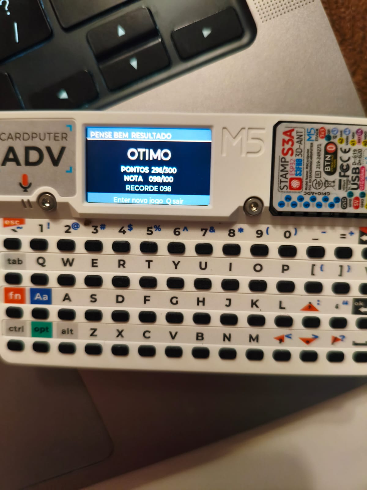

# Claude Buddy + Pense Bem on Cardputer-Adv

<p align="center">
  
</p>

<p align="center">
  <strong>One-command UIFlow2 provisioning, a polished launcher, Claude Buddy, games, and an authentic Brazilian Pense Bem experience.</strong>
</p>

<p align="center">
  
  
  
  
</p>

Flash a Cardputer-Adv and install the complete app bundle in one guided command.

| App | Experience | Network |
|---|---|---|
| **Pense Bem** | 30-question activity-book sessions, scoring, sounds, records | Offline or retry-safe online |
| **Claude Buddy** | Hardware companion for Claude Desktop | BLE |
| **Snake** | Keyboard-controlled game | None |
| **Hello Cardputer** | Minimal app and developer reference | None |

## Quick start

1. Clone this repo locally — anywhere is fine:
   ```bash
   git clone <repo-url>
   ```
   The skill auto-detects the buddy bundle relative to its own install location, so the clone path doesn't matter. `~/Downloads/m5stack/` and `~/Desktop/m5stack/` are also checked as conventional fallbacks.
2. Plug the Cardputer into your laptop via USB-C
3. Open Claude Code and start a new chat
4. Point Claude Code to the repo folder
5. Type `m5-onboard go`

That's it — Claude will automatically flash the firmware and push the apps onto the device.

### When Claude prompts you to put the device into download mode

Halfway through, Claude will pause and ask you to do this on the **back** of the device:

1. Hold down the **G0** button on the Cardputer
2. While still holding G0, press the **Reset** button
3. Release Reset first, then release G0
4. The screen goes dark — device is in download mode

Claude takes over from there.

### What happens next

- **Firmware writes to the device** (~180 seconds)
- **Apps push to the device** (~100 seconds)
- **Device reboots** straight into the launcher — pick an app and go

Done. Power the device on/off with the side switch.

## Pense Bem

Pense Bem is a single-file MicroPython app with two intentionally separate
paths:

| Mode | What appears on the Cardputer | Source of truth |
|---|---|---|
| **Offline** | Activity code, printed-book question number, attempts, feedback, score, and record | On-device formula; all books 01–99 and sections 1–6 |
| **Online** | Full Portuguese prompt, four options, attempts, feedback, and server score | Samuca `/api/v2/atari`; content currently available for code `011` |

Offline play needs no Wi-Fi and reproduces the 10/6/4 attempt scoring and
third-wrong answer reveal. Online play never consults the formula: the server
owns the question, judgment, attempt, score, and progression. If an answer POST
loses its connection, the app retries the identical `request_id` and does not
advance locally.

### Controls

| Screen | Keys |
|---|---|
| Launcher and mode picker | `;` / `.` move, Enter selects |
| Activity code | `0`–`9`, Backspace, Enter |
| Offline question | `A`–`D` answers |
| Online question | `A`–`D` answers, `;` / `.` changes text page |
| Anywhere | `Q` or Esc exits safely |

### Configure online mode

Wi-Fi credentials and the API URL live only in the device's
`esp32.NVS("pensebem")` namespace. The setup helper prompts locally, hides the
password, discards the echoed REPL script, and reboots the device; it does not
write credentials to this checkout or print them in logs.

```bash
python3 buddy/scripts/configure_pense_bem.py --port /dev/cu.usbmodem101
```

Use the LAN URL of the running Samuca server, for example
`http://192.168.1.10:18080`. Then open **Pense Bem → Online** and enter `011`.

### Verification

The accepted physical run completed all 30 questions at **296/300**, normalized
to **98/100**, with the **OTIMO** band shown in the photo above. Before any
device push, the CPython verifier read the formula directly from the shipped app
and passed all **1020/1020** captured hardware rows. A separate protocol test
proves that a simulated disconnect resends the same answer payload and that the
online path cannot call the offline formula.

## Cardputer-Adv verification (2026-08-20)

The Pense Bem delivery lane was verified on a physical Cardputer-Adv:

- USB: ESP32-S3 native USB-JTAG, VID `0x303A`
- Firmware: UIFlow2 v2.5.1, MicroPython v1.27.0-dirty (2026-08-18)
- Launcher: boots with UIFlow `boot_option=0`, keeps networking app-owned, and preserves Cardputer-Adv keyboard input
- Apps/input: Claude Buddy and Snake launch and respond to the keyboard
- HTTP: `requests2` imports successfully from the firmware
- Speaker: `M5.Speaker.tone(1000, 150)` produces an audible beep
- Keyboard API: the bundled apps document integer key codes on this build and normalize both integer and string returns; two direct REPL captures timed out while the launcher was interrupted, so application-level input is the verified observable

On this macOS host, esptool 5.3.1 lost the native USB link during the
full-flash write and left a digest mismatch. Repeating the same flow with
esptool 4.12.0 completed all 8,384,512 bytes and printed `Hash of data
verified.` The requirements therefore keep the supported 4.x line until the
5.x native-USB path is independently proven here.

## Official Bruce route (current device state)

The same hardware was subsequently returned to official Bruce 1.16.1 so Bruce
OS remains available. A GPL-3.0-only online client lives under
`buddy/brucejs/`; its accepted device filename is
`/BruceJS/Games/PenseBemOnline.js`.

The no-PSRAM Cardputer must connect Wi-Fi from Bruce before launching the
JavaScript client. The accepted compact build renders large questions/options,
submits idempotent answers, and advances after a correct server response. See
[`buddy/brucejs/README.md`](buddy/brucejs/README.md) for the exact memory,
installer, transport, and recovery constraints.

The final Bruce Games menu is intentionally limited to two future entries:
`PenseBemOnline.js` and `PenseBemOffline.js`. Only the online entry is presently
implemented; the accepted offline experience remains available in the UIFlow2
app until its BruceJS port is built and physically verified.

---

## Using Claude Buddy (BLE)

1. Power on the Cardputer
2. Pick **Claude Buddy** from the launcher menu
3. In Claude Desktop: **Help → Troubleshooting → Enable Developer Tools** (one-time, persists)
4. Then **Developer menu → Hardware Buddy → Connect**

## Per-app WiFi

The launcher intentionally does not connect to WiFi. It displays `APP WIFI`
because each app owns its network lifecycle: Pense Bem reads its private NVS
settings only after **Online** is selected, while Snake and offline Pense Bem
never wait for a missing access point. The old event-network helper remains as
an optional module for venue-specific bundles, but it is not called at boot.

## Adding your own app

1. Drop a `.py` file into `buddy/device/apps/`
2. Push just the apps without re-flashing:
   ```bash
   python3 .claude/skills/m5-onboard/scripts/install_apps.py --port <PORT> --src buddy
   ```
3. The launcher auto-discovers the new app on next boot

Crib from `buddy/device/apps/hello_cardputer.py` — it's the smallest example of the conventions (keyboard polling, font, exit behaviour).

## Getting back to stock UIFlow

The buddy bundle takes over the boot flow via `/flash/main.py`. Remove
that file and UIFlow's stock launcher boots normally on the next reset.
From the device REPL:

```python
import os
import esp32
os.remove('/flash/main.py')
nvs = esp32.NVS('uiflow')
nvs.set_u8('boot_option', 1)
nvs.commit()
import machine; machine.reset()
```

To also drop the apps under `/flash/apps/`, walk that directory the
same way and remove what you don't want.

If you want a fresh UIFlow firmware on top, re-run `m5-onboard go`
_without_ `--apps`: the skill flashes UIFlow and stops, leaving the
filesystem alone. The previous `boot_uiflow.py`-rename procedure here
referred to a backup that `install_apps.py` only creates when the
bundle ships its own root `boot.py`; the buddy bundle doesn't, so
that backup never exists for these users.

---

## Prerequisites

You need **Python 3.10+**, **git**, and **Claude Code** on your laptop. `pyserial` ships vendored inside `.claude/skills/m5-onboard/scripts/vendor/`. `esptool` is GPL-licensed and is **not** vendored — the skill auto-installs it via pip on first run if it isn't already in your environment, so the user-facing experience is still a single command. To pre-install explicitly: `python3 -m pip install --user -r requirements.txt`.

Bootstrap if needed:

- **macOS** — `python3` usually pre-installed; if not, `brew install python`
- **Linux (Debian/Ubuntu)** — `sudo apt-get install -y python3 python3-pip git`
- **Windows** — `winget install -e --id Python.Python.3.13` and `winget install -e --id Git.Git`

**Windows + older boards only:** the CH9102 USB-UART driver is needed for Basic / Fire / Core2 / StickC. Download from [WCH](https://www.wch.cn/downloads/CH343SER_EXE.html). Cardputer-Adv and CoreS3 use the in-box composite-USB driver and need nothing extra.

**Want `--apps buddy` to point at a different bundle?** The default resolves to the `buddy/device/` directory next to the skill in this repo, with `~/Downloads/m5stack/` and `~/Desktop/m5stack/` checked as fallbacks. To override (e.g. you maintain a fork or have a customized bundle elsewhere), set `M5_BUDDY_DIR`:

```bash
export M5_BUDDY_DIR=/path/to/buddy/device
```

## Troubleshooting

- **Download-mode prompt keeps retrying** — you're releasing G0 too early. Release Reset first, keep holding G0 for about a second, then release.
- **"No USB-UART bridge found" (older boards)** — install the CH9102 driver on Windows; on macOS/Linux, unplug and replug.
- **Claude Buddy never connects over BLE** — make sure the buddy launcher (not UIFlow's) owns `/flash/main.py`. The skill handles this automatically on install.
- **Launcher keys die after provisioning** — check `uiflow.boot_option`. On UIFlow 2.5.1, custom launchers require `0`; `2` runs UIFlow network setup before `main.py` and was physically reproduced with dead keyboard input. Reinstalling the apps repairs the value automatically.
- **Something else feels broken** — run `python3 .claude/skills/m5-onboard/scripts/smoke_test.py --port <PORT>` for an I2C + LCD + speaker + button check.

## What's in this repo

- **`.claude/skills/m5-onboard/`** — the Claude Code skill. Detect port, flash UIFlow, install apps. See [`.claude/skills/m5-onboard/SKILL.md`](.claude/skills/m5-onboard/SKILL.md) for the full playbook and every gotcha baked into the scripts.
- **`buddy/`** — the MicroPython app bundle that gets installed. See [`buddy/README.md`](buddy/README.md) for device-side layout and iteration tooling.

The two are decoupled by design: the `m5-onboard` skill can install any bundle via `--apps <path>`; `buddy` is just what ships here.

## License

This project's UIFlow2 code is licensed under **Apache 2.0** — see
[`LICENSE`](LICENSE) and [`NOTICE`](NOTICE). The BruceJS online client is
**GPL-3.0-only**, as marked in its source, because it runs with GPLv3 Bruce code.

The Pense Bem answer-generation constants retain the verbatim **Beerware
Revision 42** notice in
[`buddy/device/apps/pense_bem.py`](buddy/device/apps/pense_bem.py). They are
kept in that one file; the host verifier reads them from the shipped app rather
than duplicating them.

`pyserial` (BSD-3-Clause, Apache-compatible) is the only third-party package bundled in `.claude/skills/m5-onboard/scripts/vendor/`. `esptool` (GPLv2+) is intentionally not vendored; it's declared as a pip dependency in [`requirements.txt`](requirements.txt) so the repository itself stays cleanly Apache-2.0. See [`LICENSE-THIRD-PARTY.md`](LICENSE-THIRD-PARTY.md) for details.
